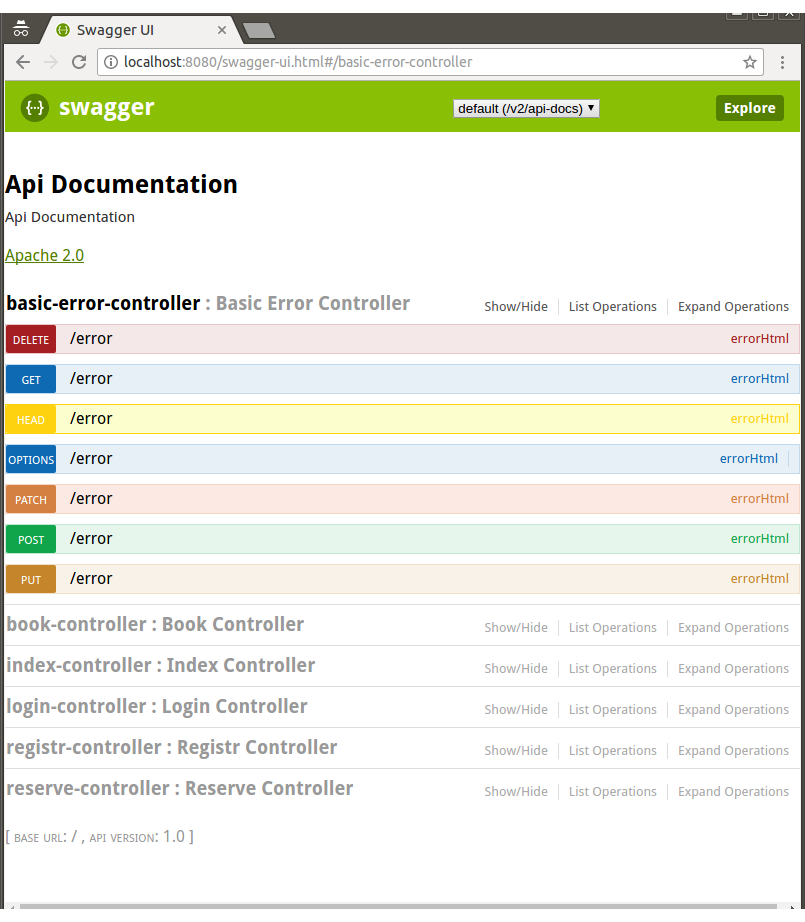
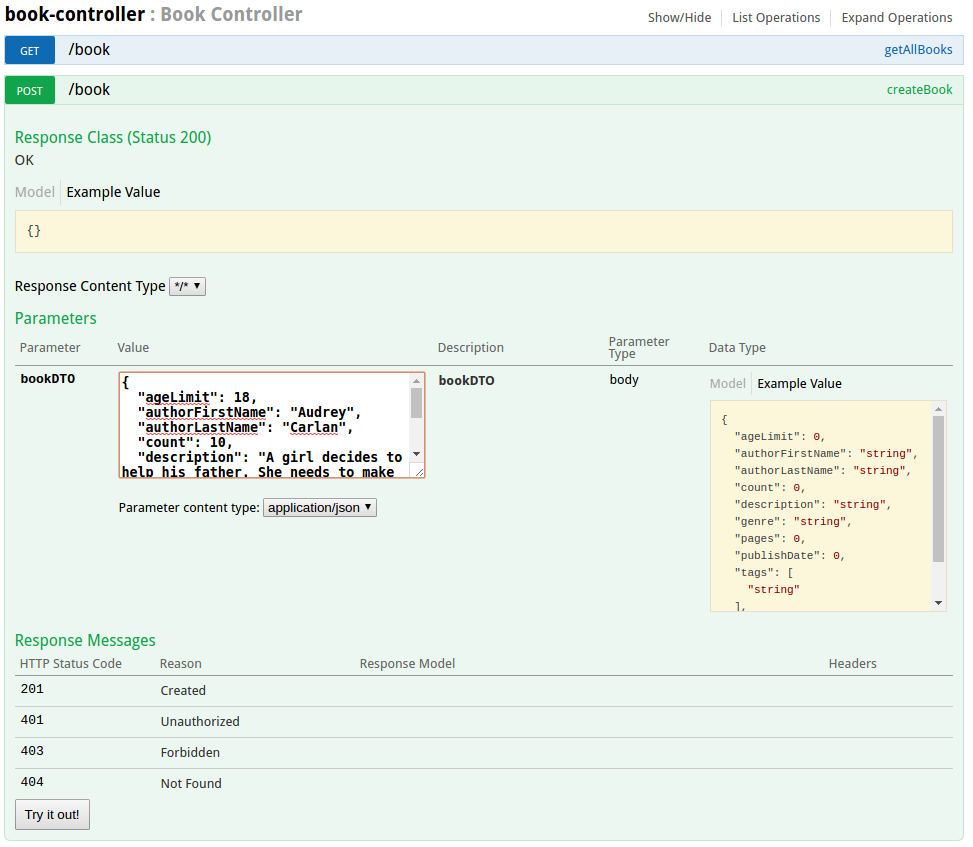
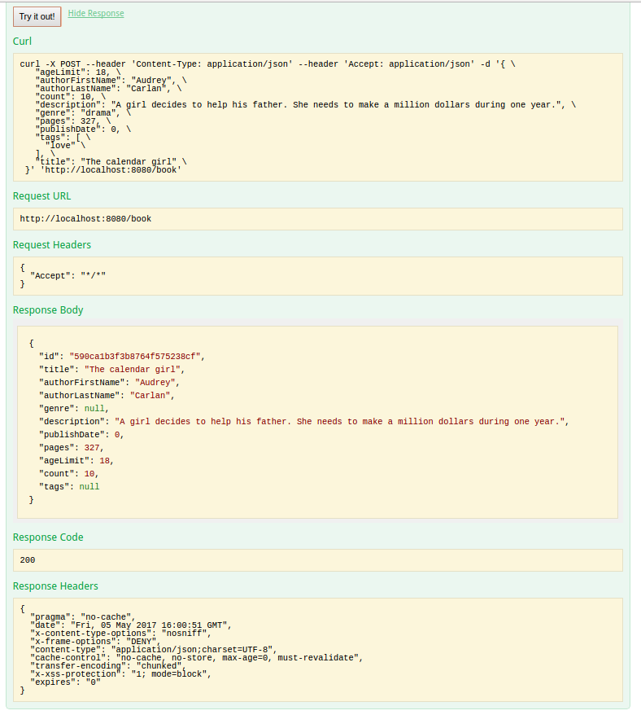

Our amazing team decided to create a booking aplication for reserving books in a library. In order to achieve succes and to reach our goal, we have used the following technologies:  

### For the server side:
SPRING Boot framework  

 

Spring boot is a suite, pre-configured, pre-sugared set of frameworks/technologies to reduce boiler plate configuration providing you the shortest way to have a Spring web application up and running with smallest line of code/configuration out-of-the-box. 

#### Swagger

 

Swagger is a powerful open source framework backed by a large ecosystem of tools that helps you design, build, document, and consume your RESTful APIs.
 
In order to view the web swagger view, run the server and access the following route: "localhost:8080/swagger-ui.html". You will be redirected to a view with all the controllers and their implemented methods, like in the image below:  

The usage of swagger is very simple. In order to try the functionality of your controllers, the only thing you have to do is to input the body value if needed, and the to press on "Try it out!" button. Let's follow an example:  

Go to book-controller and let's create a book, by opening the createBook dropdown menu and complete the body of the request:

 
Warning! Don't forget to input data for the body request. It's format should be similar to Example Value, in the rightmost part of the image.  
Well done till now! Be courageous enough now to press on "Try it out!" button to receive an output like this!

#### JUnit
To assure the system works correctly we have used the JUnit framework, which helps us to rapidly and efficiently write tests for our code.

